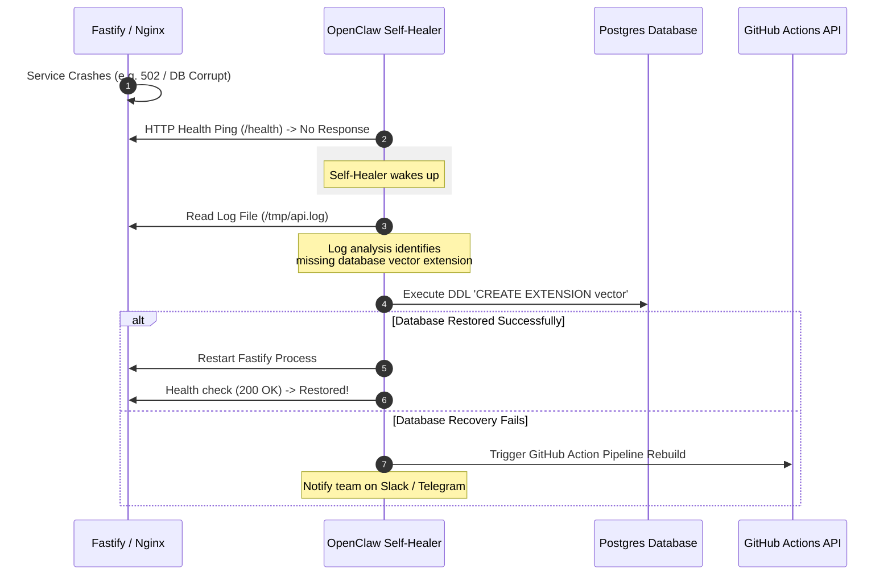

# OpenClaw Architecture Blueprint — TeleVerse Integration

This document provides a technical architectural overview of how **OpenClaw** (an autonomous, persistent AI agent framework) can be integrated into the **TeleVerse** ecosystem. It explains where the agent daemon can be hosted, how it interacts with our services, and maps out the six critical roles (QA, DEV, DEVOPS, Docs Tracker, Model Manager, and Self-Healer) it will perform.

---

## 🧭 Overview of Agentic Roles in TeleVerse

By deploying OpenClaw as an autonomous co-developer and system caretaker, we can divide its capabilities into six core automated routines:

```
                  ┌─────────────────────────────────┐
                  │        OpenClaw Daemon          │
                  │   (Autonomous Agent Core)       │
                  └────────────────┬────────────────┘
                                   │
         ┌───────────────┬─────────┼─────────┬───────────────┐
         ▼               ▼         ▼         ▼               ▼
   ┌───────────┐   ┌───────────┐┌─────┐┌───────────┐   ┌───────────┐
   │    QA     │   │  DEVOPS   ││ DEV ││ DOCUMENT  │   │  MODEL    │
   │  Tracker  │   │  Tracker  ││Agent││  Tracker  │   │  Version  │
   └─────┬─────┘   └─────┬─────┘└─────┘└─────┬─────┘   └─────┬─────┘
         │               │                   │               │
         ▼               ▼                   ▼               ▼
    Headless E2E    Self-Healing    PR Reviews   Doc Synchronization  Prompt Audits
    Playwright       Postgres /     & Automated   with DB Schemas      & Gemini 2.5
    Validations      Nginx recovery  Unit Tests   & REST Swaggers      Token Tracking
```

### 1. `QA_TRACKER` (Automated Quality Assurance)
* **Function**: Runs headless test runner loops on staging and production instances.
* **Tasks**:
  * Triggers automated browser sequences (via **Playwright** or **Cypress**).
  * Audits landing page layouts, registration flows, and form validations.
  * *Self-Healing Test Selector*: If a button class or ID shifts slightly, OpenClaw reasons through the HTML and updates the broken test locator dynamically to prevent false-alarm pipeline breaks.

### 2. `DEV_AGENT` (Autonomous Developer Partner)
* **Function**: Evaluates code quality, generates missing test cases, and flags syntax errors.
* **Tasks**:
  * Listens to Git commit hooks and pull requests.
  * Automatically writes unit tests for newly added functions in `@televerse/shared` or `@televerse/api`.
  * Suggests optimized ESM import structures to avoid runtime compilation errors.

### 3. `DEVOPS_TRACKER` (Deployment & Container Auditor)
* **Function**: Monitors the stability of the build, cache, and reverse proxy layers.
* **Tasks**:
  * Audits Docker builds and GitHub Actions outputs.
  * Detects missing pipeline variables or expired container tokens.
  * Auto-triggers rebuilds on Hugging Face when deployment commits fail to synchronize.

### 4. `DOCUMENTATION_TRACKER` (Sync Coordinator)
* **Function**: Prevents documentation drift between specifications and the codebase.
* **Tasks**:
  * Compares files in `/mds` against the live Drizzle SQL schema (`packages/db/src/schema.ts`) and flags discrepancies.
  * Audits changes in `/v1` REST paths and updates the documentation summaries in `README.md`.
  * Regenerates developer guidelines when setup steps or scripts are updated.

### 5. `MODEL_VERSION_MANAGEMENT` (AI Controller)
* **Function**: Manages prompt engineering, token consumption, and model swaps.
* **Tasks**:
  * Tracks performance metrics (speed, summary accuracy) of different models.
  * Manages systemic system prompt templates dynamically (for our upcoming **Gemini 2.5 Flash** transition).
  * Evaluates AI safety parameters to make sure the app never triggers Telegram policy blocks.

### 6. `SELF_HEALER_SYSTEM_TRACKER` (Proactive Recovery Daemon)
* **Function**: Resolves infrastructure failures on the fly without human intervention.
* **Tasks**:
  * Intercepts container startup logs (e.g. Nginx `502 Bad Gateway`, Redis timeout, or Postgres corruption errors).
  * **Automated Healing Action**: If Postgres is corrupted, runs re-initialization routines; if Next.js binds to the wrong interface, updates environment configurations (`HOSTNAME=0.0.0.0`) and triggers Nginx reloads dynamically.

---

## 🏛️ Architectural Integration Options

To run OpenClaw, we must decide where to host the agent daemon and store its memory state. Below are the three viable options, including a review of cost and execution boundaries.

### Option 1: Hugging Face Space Co-located Daemon (Sidecar Container)
*OpenClaw runs in the same container pod alongside Nginx, Next.js, and Fastify.*

* **Where it lives**: Configured as an additional entrypoint process launched inside `infra/huggingface/entrypoint.sh`.
* **State / Memory Storage**: Placed inside the `/data/openclaw` folder (leveraging Hugging Face's persistent data volume drive to prevent memory loss on container rebuilds).
* **Network Access**: Direct loopback access (`localhost:3000`, `localhost:4000`). It can read `/tmp/api.log` and `/tmp/nginx_error.log` directly.
* **Summary Table**:
  | Parameter | Value | Details |
  |---|---|---|
  | **Compute Cost** | **$0 (100% Free)** | Runs inside the same free-tier Hugging Face container pod. |
  | **Access Control** | Max Privileges | Can execute local shell commands and inspect all local system files. |
  | **Recovery Range** | Instant Healing | Can trigger local service restarts and reset databases instantly. |
  | **Resource Impact**| High | Shared CPU cores will experience load spikes during heavy LLM reasoning. |

---

### Option 2: Dedicated Autonomous Space (Isolated Peer Agent)
*OpenClaw runs in its own separate, dedicated Hugging Face Docker Space, communicating with the main app via secure webhooks and REST APIs.*

* **Where it lives**: A separate Hugging Face Space repository running an OpenClaw Docker build.
* **State / Memory Storage**: Standard persistent volume attached to the dedicated Space.
* **Network Access**: Communicates over external HTTPS with `https://talpadeavi20-televerse.hf.space/v1/`. Requires a secure token (`INTERNAL_SECRET`) for administrative operations.
* **Summary Table**:
  | Parameter | Value | Details |
  |---|---|---|
  | **Compute Cost** | **$0 (100% Free)** | Deployed as a secondary free Hugging Face Space. |
  | **Access Control** | REST / API Bounds | Secure. No direct terminal shell access to the web server container. |
  | **Recovery Range** | External Actions | Triggers recoveries via GitHub Actions hooks or admin HTTP endpoints. |
  | **Resource Impact**| Zero | Computations are fully offloaded to the secondary container. |

---

### Option 3: Local Developer Machine / CI Companion (Local Daemon)
*OpenClaw runs on your local workstation during active development, or runs inside GitHub Actions runners during validation checks.*

* **Where it lives**: Installed under `/scripts/openclaw/` in the local monorepo workspace.
* **State / Memory Storage**: Stored locally in a `.openclaw/` folder within your file system.
* **Network Access**: Has direct access to local Docker containers, local files, and git hooks.
* **Summary Table**:
  | Parameter | Value | Details |
  |---|---|---|
  | **Compute Cost** | **$0 (100% Free)** | Runs entirely on your local CPU / public CI minutes. |
  | **Access Control** | Complete | Has absolute access to the local development environment. |
  | **Recovery Range** | Pre-commit | Fixes bugs and formats code before it is pushed to production. |
  | **Resource Impact**| Minimal | Computes locally; leaves Hugging Face Space performance untouched. |

---

## 🔄 Interaction & Data Flow

When a service crash occurs (e.g., Fastify shuts down unexpectedly due to a database mismatch), OpenClaw automatically runs the following self-healing sequence:



---

## 🔒 Security & Guardrails

Giving an AI agent command execution privileges requires strict security boundaries to prevent unauthorized container access:
1. **Sandboxed Shell Execution**: If hosted as a Co-located Daemon (Option 1), the OpenClaw user should run under non-root permissions inside the Docker container (`USER node`).
2. **Key Storage Protection**: All secrets (like `HF_TOKEN`, `DATABASE_URL`, and Telegram credentials) must be injected strictly via environment variables, never hardcoded in the agent's memory or logs.
3. **Pre-push Guard**: Use local pre-commit hooks (TruffleHog) to guarantee that OpenClaw's prompt files or generated logs never contain secret strings before they are pushed to GitHub.

---

## 💡 Recommendation: How to Proceed

To start implementing OpenClaw safely and with **zero costs**, we recommend a **hybrid two-stage approach**:

> [!TIP]
> **Stage 1: CI/CD & Local Dev Companion (Option 3)**
> Build OpenClaw's configuration and skills folder inside a `/scripts/openclaw` directory. This allows you to train the agent locally to run tests, write docs, and check schemas. This is **100% safe** and doesn't affect production.

> [!IMPORTANT]
> **Stage 2: Co-located Sidecar Daemon with Persistent Storage (Option 1)**
> Once your skills are tested, package the OpenClaw daemon into our `entrypoint.sh` launch script, storing its long-term memory under `/data/openclaw`. This will give you a fully operational, self-healing production environment running on Hugging Face Spaces for free.
