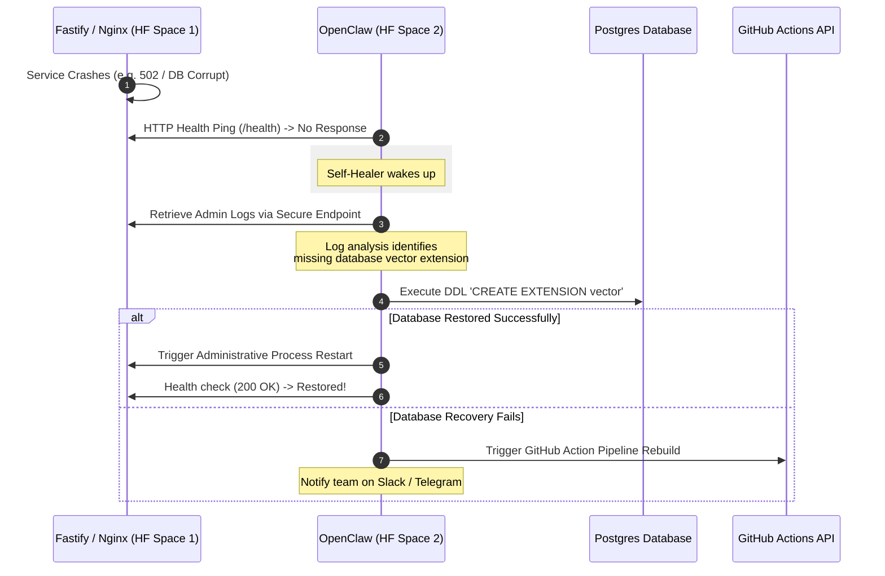

# TeleVerse — Phase 1.1: OpenClaw Autonomous Integration

This document defines the implementation specifications for Phase 1.1 of TeleVerse. We have officially selected the **Dedicated Autonomous Space (Isolated Peer Agent)** architecture for **OpenClaw** (an autonomous, persistent AI agent framework) to serve as our central QA, DevOps, and self-healing system partner.

---

## 🏛️ Selected Architecture: Dedicated Autonomous Space (Isolated Peer Agent)

Following a comparison of resource footprint, access boundaries, and system decoupling, we have chosen **Option 2 (Dedicated Autonomous Space)** as the official architecture. 

```
               ┌───────────────────────────────┐
               │    Hugging Face Space #2      │
               │   [OpenClaw Agent Container]  │
               └───────────────┬───────────────┘
                               │ (Secure HTTPS + Webhooks)
                               │ (Auth via INTERNAL_SECRET)
                               ▼
               ┌───────────────────────────────┐
               │    Hugging Face Space #1      │
               │   [TeleVerse Web/API Pod]     │
               └───────────────────────────────┘
```

### Why we selected this architecture:
1. **100% Free Compute**: Deployed as an independent free CPU-basic Hugging Face Space, keeping compute budgets at zero.
2. **Compute Isolation**: Offloads all heavy LLM reasoning, code analysis, and test run processing to a separate container, guaranteeing that our main application's frontend (Next.js) and backend (Fastify) performance remains lightning fast and unaffected.
3. **Out-of-Band Resilience (True Self-Healing)**: If the main web container crashes completely (e.g. out of memory, database locked, or port conflicts), OpenClaw remains online in its isolated sandbox. It can inspect the health failure from the outside and trigger recovery routines or a pipeline rebuild.
4. **Decoupled Security**: The agent does not have raw, unrestricted terminal access to the production application container's shell, enforcing strong security boundaries and preventing potential command-injection hazards.

---

## 🧭 Mapped Agentic Roles for Phase 1.1

OpenClaw will operate in the background as a persistent daemon running on its dedicated Space, executing six crucial automated routines for TeleVerse:

### 1. `QA_TRACKER` (Automated Quality Assurance)
* **Function**: Runs headless test runner loops on staging and production instances.
* **Tasks**:
  * Triggers automated browser sequences (via **Playwright** or **Cypress**).
  * Audits landing page layouts, registration flows, and form validations.
  * *Self-Healing Test Selector*: If a button class or ID shifts slightly, OpenClaw reasons through the HTML and updates the broken test locator dynamically to prevent false-alarm pipeline breaks.

### 2. `DEV_AGENT` (Autonomous Developer Partner)
* **Function**: Evaluates code quality, generates missing test cases, and flags syntax errors.
* **Tasks**:
  * Listens to Git commit hooks and pull requests.
  * Automatically writes unit tests for newly added functions in `@televerse/shared` or `@televerse/api`.
  * Suggests optimized ESM import structures to avoid runtime compilation errors.

### 3. `DEVOPS_TRACKER` (Deployment & Container Auditor)
* **Function**: Monitors the stability of the build, cache, and reverse proxy layers.
* **Tasks**:
  * Audits Docker builds and GitHub Actions outputs.
  * Detects missing pipeline variables or expired container tokens.
  * Auto-triggers rebuilds on Hugging Face when deployment commits fail to synchronize.

### 4. `DOCUMENTATION_TRACKER` (Sync Coordinator)
* **Function**: Prevents documentation drift between specifications and the codebase.
* **Tasks**:
  * Compares files in `/mds` against the live Drizzle SQL schema (`packages/db/src/schema.ts`) and flags discrepancies.
  * Audits changes in `/v1` REST paths and updates the documentation summaries in `README.md`.
  * Regenerates developer guidelines when setup steps or scripts are updated.

### 5. `MODEL_VERSION_MANAGEMENT` (AI Controller)
* **Function**: Manages prompt engineering, token consumption, and model swaps.
* **Tasks**:
  * Tracks performance metrics (speed, summary accuracy) of different models.
  * Manages systemic system prompt templates dynamically (for our upcoming **Gemini 2.5 Flash** transition).
  * Evaluates AI safety parameters to make sure the app never triggers Telegram policy blocks.

### 6. `SELF_HEALER_SYSTEM_TRACKER` (Proactive Recovery Daemon)
* **Function**: Resolves infrastructure failures on the fly without human intervention.
* **Tasks**:
  * Intercepts container startup logs (e.g. Nginx `502 Bad Gateway`, Redis timeout, or Postgres corruption errors).
  * **Automated Healing Action**: If Postgres is corrupted, runs re-initialization routines; if Next.js binds to the wrong interface, updates environment configurations (`HOSTNAME=0.0.0.0`) and triggers Nginx reloads dynamically.

---

## 🔄 Interaction & Recovery Flow

When a service crash occurs (e.g., Fastify shuts down unexpectedly due to a database mismatch), OpenClaw automatically runs the following self-healing sequence:



---

## 🔒 Security & Guardrails

Giving an AI agent command execution privileges requires strict security boundaries to prevent unauthorized container access:
1. **Admin Secret Token Verification**: All API endpoints exposed by TeleVerse that allow OpenClaw to fetch logs or trigger restarts MUST require a secure `INTERNAL_SECRET` header validation.
2. **Key Storage Protection**: All secrets (like `HF_TOKEN`, `DATABASE_URL`, and Telegram credentials) must be injected strictly via environment variables, never hardcoded in the agent's memory or logs.
3. **Pre-push Guard**: Use local pre-commit hooks (TruffleHog) to guarantee that OpenClaw's prompt files or generated logs never contain secret strings before they are pushed to GitHub.

---

## 💡 Implementation Path

We will construct this integration in two primary steps:
1. **Mock Environment & API Setup (Fastify Gateway)**: 
   * Add `/v1/admin/logs` and `/v1/admin/restart` endpoints to `@televerse/api` gated behind `INTERNAL_SECRET`.
   * Test endpoint query validations.
2. **OpenClaw Deployment**:
   * Create a separate repository on GitHub.
   * Configure it as a Hugging Face Space using the Docker SDK.
   * Write OpenClaw skills linking to our TeleVerse API routes, setting up the automated heartbeat daemon.
