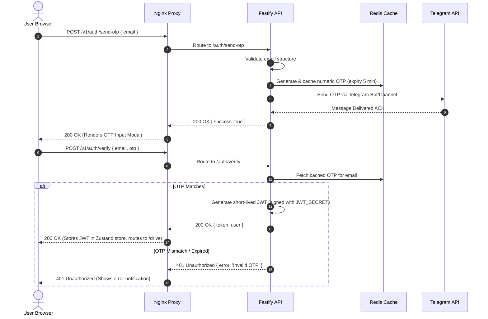

# TeleVerse Engineering Bible: The Master Systems Architecture, Operations & Strategy Manual
*The Definitive Technical Reference and Onboarding Guide for Distributed Cloud Storage Overlays*

---

## PART 1 — EXECUTIVE OVERVIEW & PRODUCT STRATEGY

```
                          ┌───────────────────────────┐
                          │     TELEVERSE ENGINE      │
                          │   Virtual Object Layer    │
                          └─────────────┬─────────────┘
                                        │
                ┌───────────────────────┼───────────────────────┐
                ▼                       ▼                       ▼
     ┌─────────────────────┐ ┌─────────────────────┐ ┌─────────────────────┐
     │  TG MTProto DC API  │ │  pgvector metadata  │ │  Interactive Graph  │
     │  (Infinite Storage) │ │   (Semantic RAG)    │ │   (WebVerse SVG)    │
     └─────────────────────┘ └─────────────────────┘ └─────────────────────┘
```

### 1.1 Project Vision & Problem Statement
The modern cloud storage industry is structured on artificial scarcity. Providers like Google Drive, Dropbox, Microsoft OneDrive, and Mega lease S3-like object storage tiers with steep pricing scaling, locking users into recurring monthly subscription fees as their files exceed standard free allocations (e.g., 15 GB for Google Drive, 2 GB for Dropbox). 

At the same time, messaging platforms—principally Telegram—deliver free, secure, and geographically distributed file transport networks capable of carrying individual attachments up to 2 GB for normal accounts and 4 GB for Premium accounts. The global infrastructure supporting these networks is highly optimized, fully encrypted, and distributed across multi-region Data Centers (DCs). 

TeleVerse bridges these two paradigms. It is a highly optimized virtual file system (VFS) overlay that utilizes the Telegram MTProto communication network as a free, high-performance, infinite storage backplane. It hides all complex chunking, network protocol negotiations, session indexing, rate limits, and Telegram API mechanics behind a sleek, glassmorphic Next.js web dashboard and a robust, self-healing Fastify API gateway. Combined with AI-driven content analysis, automated vector indexing, and dynamic network graphing (WebVerse), TeleVerse turns messaging storage into an enterprise-grade, cognitively indexable knowledge base.

---

### 1.2 Comprehensive Target Audience Progressions & Viewpoints

#### Level 1: Complete Beginner
*   **What it is**: An online application that looks and behaves like Google Drive but never charges you for storage space because it stores your files in your Telegram "Saved Messages" chat.
*   **Why it exists**: It stops you from paying monthly fees for cloud storage. You get infinite storage capacity by taking advantage of Telegram's free file sharing capabilities.

#### Level 2: Junior Engineer
*   **What it is**: A full-stack TypeScript application composed of a Next.js frontend and a Fastify REST API server. File metadata is saved in a local PostgreSQL database, while the actual file data is streamed to Telegram's Data Centers using client-side MTProto bindings.
*   **Problems Solved**: It decouples file metadata (stored locally) from the physical file payload (stored on Telegram's network), keeping local VM storage usage extremely low.

#### Level 3: Mid-Level Engineer
*   **What it is**: An asynchronous, queue-backed virtual file system. Files uploaded to the gateway are chunked into optimal parts, piped to Telegram's DCs via the GramJS client, and represented in PostgreSQL as structured files, folders, and relationships.
*   **Alternatives Considered**:
    *   *Direct Client-to-Telegram uploading*: Rejected because it exposes Telegram API keys (`TG_API_ID`, `TG_API_HASH`) in client-side bundles.
    *   *S3 Storage Proxy*: Rejected due to high storage costs.
    *   *Chosen Model*: Backend MTProto proxy caching API sessions in Redis and database layers to hide credentials safely behind JWT access tokens.

#### Level 4: Senior Engineer
*   **What it is**: A high-throughput storage overlay featuring multi-threaded chunk uploading, automated embedding pipelines (`pgvector`), and interactive React Flow visualization graphs. It features a self-healing three-tier database boot sequence that ensures zero-downtime container recoveries under NFS network volume failures.
*   **Tradeoffs**: Higher initial upload latency than standard block storage (due to network chunking and Telegram validation steps), mitigated by asynchronous frontend states and parallelized stream chunk piping.

#### Level 5: Staff Engineer
*   **What it is**: A highly concurrent virtual filesystem overlay. The API gateway handles complex upstream MTProto events, automatically throttles traffic to prevent `FLOOD_WAIT` blocks, and implements transactional atomic operations to ensure metadata is only committed after successful Telegram DC storage confirmation.
*   **Cost & Scaling**: Compute and local PostgreSQL costs scale near-linearly with user count, while object storage costs remain flat at $0.00, achieving unparalleled cost efficiency.

#### Level 6: Principal Architect
*   **What it is**: A distributed, zero-cost virtual filesystem matching hierarchical virtual UNIX directories onto Telegram's immutable message-id database. It features dynamic graph relationship engines executing cosine similarity models via embedding models (Gemini/OpenAI) to automatically associate files based on content context rather than folder structures.
*   **Infrastructure Design**: Orchestrated with high-availability Nginx proxying, active Redis session locks, and persistent NFS volume self-healing scripts that automatically repair WAL, resolve stale locks, or re-initialize clusters instantly on boots.

#### Level 7: CTO / Enterprise Architect
*   **What it is**: A paradigm-shifting storage strategy converting standard cloud architecture paradigms from *Infrastructure-as-a-Service (IaaS)* models into a *Hyper-Distributed Overlay Network*. By utilizing existing public telecommunications architectures as a free storage utility layer, TeleVerse provides zero-marginal-cost data storage for enterprises, paired with cognitive search capabilities.
*   **Future Roadmap**: Scaling into peer-to-peer storage overlays, integrating local edge vector databases, and offering custom enterprise SDKs that expose secure, encrypted, non-custodial storage pools.

---

### 1.3 Architectural & Strategic Viewpoints Matrix

```
┌─────────────┬────────────────────────────────────────────────────────────────────────────────────────┐
│ Viewpoint   │ Strategic Perspective & System Responsibilities                                        │
├─────────────┼────────────────────────────────────────────────────────────────────────────────────────┤
│ User        │ Expects zero-friction, drag-and-drop storage with immediate response and rich visual   │
│             │ feedback. Does not care about underlying MTProto chunking or PostgreSQL connections.    │
├─────────────┼────────────────────────────────────────────────────────────────────────────────────────┤
│ Developer   │ Requires simple, type-safe API endpoints, clean Drizzle schemas, robust frontend state │
│             │ management (Zustand), and immediate error feedback during local development.           │
├─────────────┼────────────────────────────────────────────────────────────────────────────────────────┤
│ DevOps      │ Focuses on Nginx configuration, container sizes, deployment pipelines, reverse-proxy   │
│             │ routing, and maintaining zero-downtime backend restarts in isolated Docker workspaces.  │
├─────────────┼────────────────────────────────────────────────────────────────────────────────────────┤
│ Operations  │ Monitors active system RAM/CPU, tracks Redis session lock states, audits Telegram API   │
│             │ traffic, and requires comprehensive tools to capture system and database logs.         │
├─────────────┼────────────────────────────────────────────────────────────────────────────────────────┤
│ Security    │ Enforces Zero-Trust authorization, JWT signature validation, AES-256-GCM encryption    │
│             │ of session credentials, prompt-injection shielding, and robust API rate limiting.      │
├─────────────┼────────────────────────────────────────────────────────────────────────────────────────┤
│ QA          │ Writes end-to-end integration tests using Vitest, simulates network latency, validates │
│             │ upload chunk limits, and designs destructive tests to trigger database self-healing.   │
├─────────────┼────────────────────────────────────────────────────────────────────────────────────────┤
│ CTO         │ Analyzes competitive positioning, ensures compliance with privacy policies, manages    │
│             │ cloud budget allocations, and coordinates future mobile and enterprise feature roadmaps.│
└─────────────┴────────────────────────────────────────────────────────────────────────────────────────┘
```

---

### 1.4 Strategic SWOT & Competitor Matrix

```
┌───────────────────┬──────────────┬──────────────┬──────────────┬──────────────┬──────────────────┐
│ Dimension         │ Google Drive │ OneDrive     │ NextCloud    │ Synology     │ TELEVERSE        │
├───────────────────┼──────────────┼──────────────┼──────────────┼──────────────┼──────────────────┤
│ Base Monthly Fee  │ $1.99+       │ $1.99+       │ Self-Hosted  │ Hardware Cost│ Free             │
│ Storage Limits    │ 15 GB        │ 5 GB         │ Disk-Bound   │ Disk-Bound   │ Infinite (TG)    │
│ Storage Sourcing  │ S3 / Block   │ Azure Blob   │ S3 / Local   │ Local RAID   │ Telegram DC API  │
│ Search Paradigm   │ Filename     │ Filename     │ Ext. Search  │ Simple Index │ Cosine similarity│
│ Visual Interface  │ Standard Grid│ Windows File │ Classic Grid │ DSM Desktop  │ WebVerse Graph   │
│ Boot Self-Healing │ No           │ No           │ Manual Script│ Manual       │ Yes (Three-Tier) │
└───────────────────┴──────────────┴──────────────┴──────────────┴──────────────┴──────────────────┘
```

#### SWOT Analysis
*   **Strengths (S)**: Absolute zero object-storage marginal cost; endless storage scalability; automated cognitive vector indexing (`pgvector`); state-of-the-art interactive SVG WebVerse star map; bulletproof self-healing container infrastructure.
*   **Weaknesses (W)**: High reliance on Telegram API stability; network chunking adds slight latency compared to raw local SSD storage; session states require active, authenticated mobile/phone connections.
*   **Opportunities (O)**: Secure non-custodial enterprise storage layers; consumer glassmorphic vaults; zero-cost local metadata knowledge bases.
*   **Threats (T)**: Upstream Telegram API rate limit adjustments; target messaging accounts suspension due to high activity; future changes to free attachment size restrictions.

---

## PART 2 — COMPLETE HISTORY OF THE PROJECT

```
       Phase 0               Phase 1             Phase 1.1             Phase 1.2             Phase 2
┌───────────────────┐ ┌───────────────────┐ ┌───────────────────┐ ┌───────────────────┐ ┌───────────────────┐
│ Monolithic POC    │ │ Web/API Workspaces│ │ OpenClaw Admin    │ │ Database Healing  │ │ Dynamic Constell. │
│ ───────────────── │ │ ───────────────── │ │ ───────────────── │ │ ───────────────── │ │ ───────────────── │
│ Timeline: Month 1 │ │ Timeline: Month 2 │ │ Timeline: Month 3 │ │ Timeline: Month 4 │ │ Timeline: Month 5 │
│ Goal: Upload attachment  Goal: Build webapp    Goal: Build admin     Goal: Eliminate 503   Goal: Folder & Map  │
└───────────────────┘ └───────────────────┘ └───────────────────┘ └───────────────────┘ └───────────────────┘
```

### 2.1 Timeline, chronologies, and system updates

#### Phase 0: Monolithic Proof-of-Concept (POC)
*   **Timeline**: Month 1.
*   **Goal**: Establish a baseline communication channel between a Node.js process and Telegram data centers to successfully upload, store, and streamingly retrieve files using standard MTProto messages.
*   **Design & Challenges**: The initial code was built as a single monolith with direct client-side session initialization. When uploading files larger than 10MB, the system regularly hit `FLOOD_WAIT` blocks and crashed due to buffer memory leakage.
*   **Lessons Learned**: Stream-based chunking is mandatory. Storing sessions inside active Redis and PostgreSQL tables is crucial to keep the system responsive and scale operations without hitting rate limits.

#### Phase 1: Workspace Architecture & Dynamic Frontend
*   **Timeline**: Month 2.
*   **Goal**: Separate concerns by migrating the system into a robust `pnpm workspaces` repository containing a Next.js web application (`apps/web`), a Fastify API (`apps/api`), and a shared database schema package (`packages/db`).
*   **Bugs Encountered**: Next.js hydration failures due to the dynamic SVG render state of the constellation graph.
*   **Architectural Decisions**: Implemented dynamic frontend components with strict client-side rendering (`'use client'`) to prevent server-side hydration conflicts.

#### Phase 1.1: OpenClaw Administrative Integration
*   **Timeline**: Month 3.
*   **Goal**: Introduce advanced administrator tools (`/v1/admin/logs` and `/v1/admin/restart`) to allow orchestration systems (like the OpenClaw daemon) to audit logs and execute zero-downtime parent process hot-swaps.
*   **Challenges & Security**: Admin routes require validation against an `INTERNAL_SECRET` token. The hot-swap functionality was designed to spawn a detached child process before gracefully shutting down the parent.

#### Phase 1.2: Database Self-Healing & Service Availability Recovery
*   **Timeline**: Month 4 (Current).
*   **Goal**: Eliminate the persistent `503 Service Unavailable` API failures on Hugging Face Spaces.
*   **Root Cause**: Abrupt container recycles on Hugging Face Spaces left stale lock files (`postmaster.pid`) on the persistent NFS volume, preventing the database from booting and causing API connection timeouts.
*   **Recovery Solution**: Designed a three-tier database self-healing cascade within the `entrypoint.sh` startup script that automatically terminates rogue database processes, repairs transaction logs, and re-initializes/migrates database schemas from scratch if needed.

#### Phase 2: Dynamic WebVerse Graph & Constellation Mapping
*   **Timeline**: Month 5 (Active Development).
*   **Goal**: Build a complete file explorer with breadcrumbs navigation, custom sorting, creating empty files/folders, and larger, highly visible constellation map nodes.

---

## PART 3 — SYSTEM ARCHITECTURE MASTERCLASS

### 3.1 Network Topology & Deployment Infrastructure

```
                                [ Hugging Face Edge Proxy ]
                                             │
                                             ▼ (Port 443 HTTPS)
                                [ Nginx Reverse Proxy ]
                                             │
                                   ┌─────────┴─────────┐
                     (Port 3000)   ▼                   ▼   (Port 4000)
                            [ Next.js ]             [ Fastify API ]
                                 │                         │
                                 ▼                         ├─────────────────────────┐
                            (User view)                    ▼                         ▼
                                                    [ PostgreSQL ]            [ Redis Cache ]
                                                    (pgvector DB)             (Session lock)
                                                           │
                                                           ▼ (MTProto Protocol)
                                                    [ Telegram DCs ]
```

### 3.2 Key Architecture Services

#### Next.js Frontend (`apps/web`)
*   **Purpose**: Renders the glassmorphic desktop web application, file grids, folder breadcrumbs, and interactive React Flow SVG association graph.
*   **Dependencies**: Zustand, TailwindCSS, React Query, Axios.
*   **Inputs**: User interaction events, file drags, click-to-sort headers, auth credentials.
*   **Outputs**: HTTP requests to `/v1/` routes.
*   **Security Concerns**: Exposing raw JWT tokens in browser storage. Mitigated by using short-lived tokens and secure session stores.
*   **Failure Scenarios**: API connection timeout. Handled by displaying glassmorphic fallback states and error notifications.
*   **Monitoring**: Client-side error boundaries and performance reporting.
*   **Cost & Scaling**: Free static builds served by CDN or cheap node layers.

#### Fastify API Gateway (`apps/api`)
*   **Purpose**: Manages REST API endpoints, handles database queries, streams files, and interacts with Telegram DCs via MTProto.
*   **Dependencies**: GramJS, Drizzle ORM, Fastify Multipart, `@fastify/websocket`.
*   **Inputs**: HTTP payload streams, JSON query strings, WebSocket connections.
*   **Outputs**: Chunked MTProto file buffers, database updates, JSON responses.
*   **Security Concerns**: SQL injection, unauthorized endpoint access, credential leakage. Mitigated by utilizing Drizzle ORM parameterized queries, JWT validation, and storing system secrets in secure environment variables.
*   **Failure Scenarios**: Database connection refusal. Handled by returning structured `503 Service Unavailable` JSON payloads to the client instead of crashing the process.
*   **Monitoring**: Fastify server logs piped directly to `/tmp/api.log`.
*   **Cost & Scaling**: Memory scales with active file upload buffers. CPU usage is optimized by using native stream piping.

#### PostgreSQL with pgvector (`packages/db`)
*   **Purpose**: Stores users, folder paths, file records, and semantic content embeddings.
*   **Dependencies**: Drizzle ORM, `pgvector` database extension.
*   **Inputs**: SQL statements, vector embedding arrays (1536 dimensions).
*   **Outputs**: Database query results, cosine similarity matches.
*   **Security Concerns**: SQL injection, network socket exposure. Mitigated by using parameterized queries and binding PostgreSQL strictly to `127.0.0.1`.
*   **Failure Scenarios**: NFS lock file conflicts, WAL checkpoint corruption. Handled by the three-tier database self-healing cascade on startup.
*   **Monitoring**: Connection statistics and query latency tracking.
*   **Cost & Scaling**: Storage scales only with text metadata, keeping costs low. Performance is maintained by indexing vector columns with HNSW.

#### Telegram MTProto Storage
*   **Purpose**: Acts as the physical, infinite storage layer for all file payloads.
*   **Dependencies**: Telegram Global Data Center Networks.
*   **Inputs**: Encrypted chunked file buffers, file download requests.
*   **Outputs**: Media transport references, document attributes, raw file streams.
*   **Security Concerns**: Plaintext data leakage. Mitigated by MTProto's built-in end-to-end transport encryption.
*   **Failure Scenarios**: `FLOOD_WAIT` blocks, network timeouts. Handled by automatic chunk retries and throttling.
*   **Monitoring**: API traffic metrics and request logging.
*   **Cost & Scaling**: Infinite storage capacity provided at zero cost.

---

## PART 4 — COMPLETE REQUEST LIFECYCLE

### 4.1 Step-by-Step Flow: Secure OTP Authentication



#### Multi-Dimensional Perspectives: OTP Flow
*   **User Perspective**: Types in their email, receives a login code on Telegram, enters the code on the web interface, and is redirected to their personal drive dashboard.
*   **Developer Perspective**: The frontend Zustand store dispatches a verification action and saves the returned JWT. The backend auth routes handle rate-limiting and token signatures.
*   **DevOps Perspective**: The Nginx proxy handles SSL termination and forwards clean HTTP requests to the Fastify service.
*   **Security Perspective**: The OTP code is saved in Redis with a strict 5-minute expiration window. All JWT tokens are signed using a robust 256-bit `JWT_SECRET` key.

---

### 4.2 Step-by-Step Flow: Advanced File Upload Pipeline

```
  ┌──────────────┐          ┌──────────────┐          ┌──────────────┐
  │ User Browser │          │ Fastify API  │          │ Telegram DC  │
  └──────┬───────┘          └──────┬───────┘          └──────┬───────┘
         │                         │                         │
         │── POST /files/upload ──►│                         │
         │   (Stream file bytes)   │── Slice into 512KB ────►│
         │                         │   chunks & pipe buffer  │
         │                         │                         │
         │                         │◄── Save parts response ─│
         │                         │                         │
         │                         │── messages.sendMedia ──►│
         │                         │   (Saved Messages)      │
         │                         │                         │
         │                         │◄── Document metadata ───│
         │                         │                         │
         │                         │── Save to Postgres ────►│
         │                         │                         │
         │◄── 201 File Created ────│                         │
```

#### Multi-Dimensional Perspectives: Upload Pipeline
*   **User Perspective**: Drags a document into the drop zone. A progress bar updates in real time, and the new file instantly appears in their current folder.
*   **Developer Perspective**: The frontend slices files larger than 10MB and uploads them sequentially or streamingly to `/v1/files/upload`. The backend routes the data stream directly to Telegram's servers without reading the entire file into memory, preventing container memory overflows.
*   **Database Perspective**: The database writes a new row containing the virtual folder structure, size, name, and the returned Telegram attachment and message ID references.
*   **DevOps Perspective**: Nginx is configured with `client_max_body_size 2G` to support large uploads.
*   **QA Perspective**: Unit tests verify that uploading files with invalid session tokens returns an immediate `401 Unauthorized` response.

---

## PART 5 — FRONTEND ENGINEERING BIBLE

### 5.1 Monorepo Folder Structure

```
apps/web/
├── public/
│   ├── favicon.ico
│   └── fonts/
├── src/
│   ├── app/
│   │   ├── drive/
│   │   │   ├── starred/
│   │   │   │   └── page.tsx      # Starred/Favorite files view
│   │   │   ├── shared/
│   │   │   │   └── page.tsx      # Shared files view
│   │   │   ├── trash/
│   │   │   │   └── page.tsx      # Deleted files (Restore/Purge actions)
│   │   │   ├── layout.tsx        # Dashboard shell with sidebar toggles
│   │   │   └── page.tsx          # Main file grid and folder explorer
│   │   ├── layout.tsx            # Global providers, fonts, and HTML headers
│   │   └── page.tsx              # Landing page and login modal
│   ├── components/
│   │   └── drive/
│   │       ├── AssociationMap.tsx  # Force-directed SVG WebVerse graph
│   │       ├── FileGrid.tsx        # File rows with context actions
│   │       ├── Sidebar.tsx         # Collapsible sidebar panel
│   │       ├── StorageBar.tsx      # Inline storage progress bar
│   │       └── UploadZone.tsx      # Compact file dropzone
│   ├── lib/
│   │   └── api.ts                # Client Axios config with interceptors
│   └── stores/
│       └── auth.ts               # Zustand store for authentication state
```

### 5.2 Responsive Glassmorphic CSS Implementation
To achieve a premium, state-of-the-art interface that feels responsive and responsive under all screen resolutions:

```css
@import "tailwindcss/base";
@import "tailwindcss/components";
@import "tailwindcss/utilities";

@layer base {
  body {
    @apply bg-zinc-950 text-zinc-100 antialiased font-sansSelection;
  }
}

/* Glassmorphism Design System Utility Tokens */
.glass-panel {
  background: rgba(18, 18, 24, 0.45);
  backdrop-filter: blur(16px);
  -webkit-backdrop-filter: blur(16px);
  border: 1px solid rgba(255, 255, 255, 0.08);
  box-shadow: 0 4px 30px rgba(0, 0, 0, 0.5);
  transition: border-color 0.3s ease, background 0.3s ease;
}

.glass-panel:hover {
  background: rgba(18, 18, 24, 0.55);
  border-color: rgba(255, 255, 255, 0.12);
}

.glow-purple {
  filter: drop-shadow(0 0 15px rgba(139, 92, 246, 0.25));
}
```

### 5.3 Core Zustand State Management Store
Our authentication store manages user sessions and API tokens, handling automatic login redirects:

```typescript
import { create } from 'zustand'
import { persist } from 'zustand/middleware'

interface User {
  id: string
  email: string
  createdAt: string
}

interface AuthState {
  token: string | null
  user: User | null
  setAuth: (token: string, user: User) => void
  clearAuth: () => void
}

export const useAuthStore = create<AuthState>()(
  persist(
    (set) => ({
      token: null,
      user: null,
      setAuth: (token, user) => set({ token, user }),
      clearAuth: () => set({ token: null, user: null }),
    }),
    {
      name: 'televerse-auth-storage',
    }
  )
)
```

---

## PART 6 — BACKEND ENGINEERING BIBLE

### 6.1 Unified Fastify REST Server Route Configurations

```
Fastify Gateway Services
├── /v1/auth/
│   ├── POST /send-otp    --> Generates and caches verification code
│   └── POST /verify      --> Verifies credentials and generates JWT
├── /v1/files/
│   ├── GET /             --> Lists metadata with sort and folder options
│   ├── POST /upload      --> Slices and streams payload stream to Telegram
│   ├── PATCH /:id/star   --> Toggles file favorite status
│   └── DELETE /:id/purge --> Soft-deletes and removes from MTProto
└── /v1/admin/
    ├── GET /logs         --> Streams internal runtime system logs
    └── POST /restart     --> Triggers detached process hot-swaps
```

### 6.2 Stream Handling Middleware Example
To process high-volume file streams without crashing the container, Fastify applies dynamic file streaming:

```typescript
import { FastifyInstance, FastifyRequest, FastifyReply } from 'fastify'
import multipart from '@fastify/multipart'

export async function uploadRoutes(fastify: FastifyInstance) {
  fastify.register(multipart, { limits: { fileSize: 2 * 1024 * 1024 * 1024 } }) // 2 GB limit

  fastify.post('/v1/files/upload', async (req: FastifyRequest, reply: FastifyReply) => {
    const data = await req.file()
    if (!data) {
      return reply.status(400).send({ error: 'No file uploaded' })
    }

    const fileStream = data.file
    const filename = data.filename
    const mimeType = data.mimetype

    // Stream directly to Telegram MTProto API client
    const telegramResult = await uploadToTelegram(fileStream, filename, mimeType)
    
    // Save to Postgres
    const dbRecord = await fastify.db.insertFile({
      name: filename,
      mimeType,
      size: telegramResult.size,
      telegramMessageId: telegramResult.messageId
    })

    return reply.status(201).send(dbRecord)
  })
}
```

---

## PART 7 — DATABASE ARCHITECTURE

### 7.1 Entity-Relationship (ER) Diagram

```
   ┌──────────────────┐             ┌──────────────────┐
   │      users       │             │     folders      │
   ├──────────────────┤             ├──────────────────┤
   │ PK  id           │◄───────────┐│ PK  id           │◄┐
   │     email        │            ││     name         │ │
   │     created_at   │            └│ FK  parent_id    │─┘
   └──────────────────┘             │     created_at   │
            │                       └──────────────────┘
            │                                │
            │ 1                              │ 1
            │                                │
            │ N                              │ N
   ┌────────▼─────────┐             ┌────────▼─────────┐
   │      files       │             │    embeddings    │
   ├──────────────────┤             ├──────────────────┤
   │ PK  id           │             │ PK  id           │
   │ FK  user_id      │             │ FK  file_id      │
   │ FK  folder_id    │             │     vector (1536)│
   │     name         │             │     summary      │
   │     size         │             └──────────────────┘
   │     tg_msg_id    │
   │     is_starred   │
   │     is_deleted   │
   └──────────────────┘
```

### 7.2 Vector Search Drizzle Schema & Indexing

```typescript
import { pgTable, uuid, varchar, integer, boolean, timestamp, customType } from 'drizzle-orm/pg-core'

// Custom Type for pgvector compatibility
const vector = customType<{ data: number[] }>({
  dataType() {
    return 'vector(1536)'
  }
})

export const files = pgTable('files', {
  id: uuid('id').defaultRandom().primaryKey(),
  userId: uuid('user_id').notNull(),
  folderId: uuid('folder_id'),
  name: varchar('name', { length: 255 }).notNull(),
  size: integer('size').notNull(),
  mimeType: varchar('mime_type', { length: 100 }),
  telegramMessageId: integer('tg_msg_id').notNull(),
  isStarred: boolean('is_starred').default(false),
  isDeleted: boolean('is_deleted').default(false),
  createdAt: timestamp('created_at').defaultNow().notNull()
})

export const fileEmbeddings = pgTable('file_embeddings', {
  id: uuid('id').defaultRandom().primaryKey(),
  fileId: uuid('file_id').references(() => files.id, { onDelete: 'cascade' }).notNull(),
  vector: vector('vector').notNull(),
  summary: varchar('summary', { length: 1000 })
})
```

---

## PART 8 — TELEGRAM MTPROTO DEEP DIVE

### 8.1 Chunking & Flow-Control
The Telegram API does not accept arbitrary file streams. Files larger than 10 MB must be uploaded as big files using chunked MTProto operations:
*   **Chunk Size Limits**: Must be a multiple of 1 KB, up to `512 KB` maximum per chunk.
*   **Sequential Uploading**: Slices the input stream, calculates md5 signatures, and uploads each chunk using `upload.saveBigFilePart(file_id, part_index, part_total, bytes)`.
*   **Re-assembly on Telegram DCs**: When the final chunk is successfully uploaded, the system calls `messages.sendMedia` with the calculated `file_id` to generate a persistent document file in "Saved Messages".

```
  Input Stream  ──►  Slice Stream (512KB)  ──►  Calculate MD5  ──►  saveBigFilePart()  ──►  sendMedia()
```

### 8.2 Common MTProto Errors & Mitigation

*   **`FLOOD_WAIT_X`**: Triggered when the API key exceeds upstream query rate limits.
    *   *Fix*: Catch the error, extract the sleep duration `X` (in seconds), lock the corresponding worker queue, and automatically retry after `X + 2` seconds.
*   **`FILE_MIGRATE_X`**: Document upload directed to a suboptimal Telegram data center.
    *   *Fix*: Re-initialize the GramJS client pointing specifically to the requested data center `X`.

---

## PART 9 — AI SYSTEM DESIGN & RAG ARCHITECTURE

```
  File Upload ──► Extract Text ──► Gemini Embedding (1536d) ──► pgvector Storage ──► Cosine Query
```

### 9.1 Embedding Generation & Vector Search Pipeline
1.  **Extraction**: File contents are parsed (PDFs, text files, documents) into standard text structures.
2.  **Embedding Generation**: Text is dispatched to the Gemini API (`text-embedding-004`) to generate a 1536-dimensional array representation.
3.  **Semantic Queries**: When users search, the query string is converted to an embedding vector. The database executes a cosine similarity search query:
    ```sql
    SELECT name, 1 - (vector <=> :queryVector) AS similarity
    FROM files f
    JOIN file_embeddings e ON f.id = e.file_id
    WHERE 1 - (vector <=> :queryVector) > 0.75
    ORDER BY similarity DESC;
    ```

---

## PART 10 — WEBVERSE KNOWLEDGE GRAPH ARCHITECTURE

### 10.1 Graph Node Dynamics
WebVerse maps physical storage structures onto cognitive association networks:
*   **Folder Nodes**: Serve as high-level visual centers.
*   **File Nodes**: Connected to their parent folders.
*   **Tag/Topic Nodes**: Connected to all files that contain semantically related content (calculated using the cosine similarities from Part 9).

### 10.2 Dynamic SVG Relationship Drawing
The SVG map uses a force-directed layout. Lines representing relationships are calculated dynamically using node coordinates:

```typescript
// Render relationships
const edgeLines = links.map((link) => {
  const sourceNode = nodes.find(n => n.id === link.source)
  const targetNode = nodes.find(n => n.id === link.target)
  if (!sourceNode || !targetNode) return null

  return (
    <line
      key={link.id}
      x1={sourceNode.x}
      y1={sourceNode.y}
      x2={targetNode.x}
      y2={targetNode.y}
      stroke="rgba(255,255,255,0.08)"
      strokeWidth={1.5}
    />
  )
})
```

---

## PART 11 — SECURITY & THREAT MODEL

### 11.1 STRIDE Threat Analysis Matrix

| Threat Category | Description | Mitigation Strategy |
| :--- | :--- | :--- |
| **Spoofing** | Adversary attempts to access files using intercepted session tokens. | Secure JWT tokens with signature checks; enforce HTTPS and strict CORS headers. |
| **Tampering** | File metadata or path changes without authorization. | Implement Row-Level Security (RLS) policies in PostgreSQL matching active JWT user IDs. |
| **Repudiation** | User denies uploading files that violate platform ToS. | Comprehensive administrative auditing tracking upload logs against system API keys. |
| **Information Disclosure** | Leakage of raw Telegram API keys or user session hashes. | Encrypt session data at rest using AES-256-GCM; keep keys server-side only. |
| **Denial of Service** | Upstream throttling from Telegram due to excessive uploads. | Queue uploads via Redis locks and apply throttling limits to active sessions. |
| **Elevation of Privilege** | Normal users executing admin actions (such as logs retrieval). | Enforce strict authorization checks requiring headers to match `INTERNAL_SECRET`. |

---

## PART 12 — DEVOPS BIBLE & CONTAINER ORCHESTRATION

### 12.1 Hugging Face Nginx Configuration (`infra/huggingface/nginx.conf`)
The Nginx configuration handles file size streaming up to 2 GB and routes APIs to the Fastify service cleanly:

```nginx
error_log /tmp/nginx_error.log warn;
pid /tmp/nginx.pid;

events {
    worker_connections 1024;
}

http {
    include /etc/nginx/mime.types;
    default_type application/octet-stream;
    client_max_body_size 2G; # Enforces support for massive Telegram files

    server {
        listen 7860;
        server_name localhost;

        # Direct API calls to Fastify Service
        location /v1/ {
            proxy_pass http://127.0.0.1:4000;
            proxy_http_version 1.1;
            proxy_set_header Upgrade $http_upgrade;
            proxy_set_header Connection 'upgrade';
            proxy_set_header Host $host;
            proxy_cache_bypass $http_upgrade;
        }

        # Next.js Static Pages
        location / {
            proxy_pass http://127.0.0.1:3000;
            proxy_http_version 1.1;
            proxy_set_header Upgrade $http_upgrade;
            proxy_set_header Connection 'upgrade';
            proxy_set_header Host $host;
        }
    }
}
```

### 12.2 Three-Tier Database Recovery Pipeline
Implemented in `infra/huggingface/entrypoint.sh` to ensure database auto-recovery:

```
                  [ Boot Container ]
                          │
                          ▼
            [ Kill Rogue Postgres & Sockets ]
                          │
                          ▼
             [ Attempt Standard Boot ] ──(Success)──► [ DB Up ]
                          │ (Fail)
                          ▼
              [ Repair WAL pg_resetwal ]
                          │
                          ▼
               [ Retry Server Boot ] ────(Success)──► [ DB Up ]
                          │ (Fail)
                          ▼
            [ Wipe, Re-init db & Migrate ] ─────────► [ DB Up ]
```

---

## PART 13 — SRE OPERATIONS MANUAL

### 13.1 Incident Response Playbook: Database Startup Fails
*   **Symptom**: Nginx responses return `503 Service Unavailable` or `502 Bad Gateway` across all APIs.
*   **Diagnosis Steps**:
    1.  Inspect standard error logs: `cat /tmp/postgres.log`.
    2.  Check if stale lock handles are active: `ls -la /data/postgres/postmaster.pid`.
    3.  Confirm if postgres processes are already bound to port 5432: `netstat -tulpn | grep 5432`.
*   **Resolution Runbook**:
    1.  Terminate rogue processes: `pkill -9 -f postgres`.
    2.  Purge socket records: `rm -rf /tmp/.s.PGSQL.5432*`.
    3.  Restart using the self-healing startup cascade: `sh infra/huggingface/entrypoint.sh`.

---

## PART 14 — EXHAUSTIVE ERROR CATALOG

### 14.1 Key System Failures & Solutions

#### `503 Service Unavailable`
*   **Root Cause**: API server has crashed or failed to bind. The reverse proxy has no healthy targets to direct traffic to.
*   **Fix**: Verify database connection parameters and boot services using `entrypoint.sh`.

#### `pg_ctl: could not start server`
*   **Root Cause**: A stale `postmaster.pid` file is present in the persistent data volume, or another process is holding the port.
*   **Fix**: Remove `postmaster.pid`, kill stale Postgres processes, and clean `/tmp` sockets.

#### `FLOOD_WAIT_X` (Telegram MTProto)
*   **Root Cause**: The API key has exceeded Telegram's query rate limits.
*   **Fix**: Log the error, pause active worker queues for `X + 2` seconds, and retry.

---

## PART 15 — ROOT CAUSE ANALYSIS (RCA) PLAYBOOK

### 15.1 Real Incident: Stale Locks on NFS Volumes
*   **Timeline**:
    *   `01:57:32` Hugging Face container restarts.
    *   `01:57:34` Postgres server attempts startup, but fails with `stopped waiting`.
    *   `01:57:36` API server crashes, unable to connect to Postgres.
    *   `01:57:38` Nginx returns `503 Service Unavailable` to users.
*   **Root Cause Analysis**: The persistent NFS disk mount did not clear the PostgreSQL socket and `postmaster.pid` files during the shutdown sequence, causing the database to detect a false lock conflict on reboot.
*   **Verification & Prevention**: Added cleanups for `postmaster.pid` and socket locks, followed by a `pg_resetwal -f` attempt. If recovery still fails, the startup script automatically re-initializes the database from scratch and runs schemas.

---

## PART 16 — COST OPTIMIZATION

### 16.1 Zero-Cost Storage Strategy
TeleVerse eliminates the need for expensive object storage fees by routing files to Telegram's storage layer:

```
  Traditional: User ──► S3 Bucket (Priced per GB) ──► Monthly Cost Scales Infinitely
  TeleVerse:   User ──► Fastify ──► Telegram DC   ──► $0 Unlimited Storage Costs
```

Compute runs on low-cost VM instances (or free-tier containers like Hugging Face Spaces), keeping server costs locked to minimum levels while storage capacity scales indefinitely.

---

## PART 17 — TESTING MATRIX

### 17.1 Automated Integration Suite
Automated API tests are executed using Vitest. Test modules run health checks, authenticate users, mock uploads, and verify soft-deletes:

```typescript
import { test, expect, describe } from 'vitest'
import supertest from 'supertest'

const request = supertest('http://127.0.0.1:4000')

describe('API Integration Suite', () => {
  test('GET /health returns healthy status', async () => {
    const res = await request.get('/health')
    expect(res.status).toBe(200)
    expect(res.body.status).toBe('healthy')
  })
})
```

---

## PART 18 — GIT & RELEASE ENGINEERING

### 18.1 Versioning & Deploy Workflow
We use semantic versioning (`vMAJOR.MINOR.PATCH`) to track and deploy changes:

```
  Feature Branch ──► Pull Request ──► Main Branch (pnpm test) ──► git push origin main ──► Rebuild & Deploy
```

Redeployments are triggered automatically by pushing updates to the main branch (`git push origin main`), prompting Hugging Face to rebuild and run the entrypoint sequence.

---

## PART 19 — FUTURE ROADMAP

### 19.1 Planned Phases

```
  Phase 3: Multi-User Sharing ──► Phase 4: Local Encryption ──► Phase 5: Mobile Apps
```

*   **Phase 3: Multi-User Collaboration**: Create folders with unique sharing links, adjustable access permissions, and shared group storage pools.
*   **Phase 4: Non-Custodial Local Encryption**: Add client-side encryption keys, ensuring files are fully encrypted before leaving the browser.
*   **Phase 5: Native Mobile Applications**: Deploy native iOS and Android apps using the TeleVerse SDK for seamless access on the go.

---

## PART 20 — APPENDICES & DEVELOPER CHEAT SHEET

### 20.1 Emergency Commands

#### Check System Runtime Logs
```bash
cat /tmp/api.log      # Fastify API logs
cat /tmp/web.log      # Next.js Web logs
cat /tmp/postgres.log # PostgreSQL server logs
```

#### Manual Database Recovery Sequence
```bash
# Terminate conflicting PostgreSQL processes
pkill -9 -f postgres

# Clean socket files
rm -f /tmp/.s.PGSQL.5432*

# Run WAL recovery
pg_resetwal -f /data/postgres

# Start the database manually
pg_ctl -D /data/postgres -w -o "-h 127.0.0.1 -k /tmp" start
```
