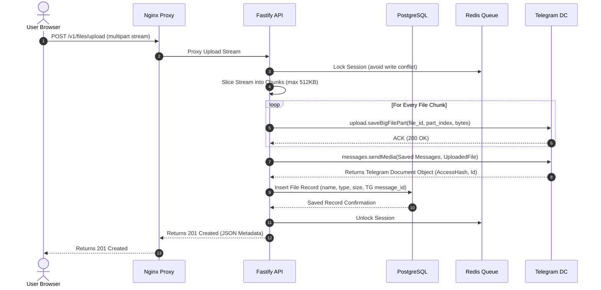

# TeleVerse Engineering Bible: The Definitive Systems Architecture, Operations & Strategy Manual

---

## PART 1 — EXECUTIVE OVERVIEW & PRODUCT STRATEGY

```
   ┌──────────────────────────────────────────────────────────┐
   │                       TELEVERSE                          │
   │      "The Autonomous, Infinite Cloud Storage Engine"     │
   └────────────┬─────────────────────────────┬───────────────┘
                │                             │
    ┌───────────▼───────────┐     ┌───────────▼───────────┐
    │  Infinite TG Storage  │     │   AI Constellations   │
    │  (Via MTProto Protocol│     │ (Semantic Graph Map)  │
    └───────────────────────┘     └───────────────────────┘
```

### 1.1 Project Vision & Problem Statement
TeleVerse is designed to address a critical inefficiency in cloud data storage: the artificial pricing scaling of commodity cloud drives versus the abundant, underutilized capacity of free messaging network attachments. Modern enterprise and personal storage systems (Google Drive, Dropbox, OneDrive) charge premium subscriptions for block or object storage, scaling aggressively as users cross tier boundaries. 

At the same time, messaging platforms—specifically Telegram—offer free, high-speed, secure media attachment delivery with high per-file limits (up to 2 GB for standard accounts, 4 GB for Premium). TeleVerse bridges this gap, establishing a self-healing, zero-cost, infinite storage layer that aggregates Telegram’s MTProto storage networks into a unified virtual filesystem with high-performance querying, AI-powered semantic folder layouts, and interactive relational graphs (WebVerse).

### 1.2 Level 1 to Level 7 Progressions

#### Level 1: Complete Beginner
*   **What it is**: TeleVerse is a website that lets you upload, download, and organize files in a folder structure, just like Google Drive, but it stores the files inside Telegram "Saved Messages" without charging you for space.
*   **Why it exists**: Regular cloud drives quickly run out of free space and force you to pay monthly subscriptions. TeleVerse gives you unlimited space for free by using Telegram's message attachments behind the scenes.

#### Level 2: Junior Engineer
*   **What it is**: A full-stack web application consisting of a Next.js frontend and a Fastify backend. Files are uploaded from the browser, chunked by the server, sent to Telegram using the GramJS MTProto client library, and their metadata (name, size, Telegram attachment IDs) is stored in a PostgreSQL database.
*   **Problems Solved**: It bypasses the need for local or expensive AWS S3 buckets for actual file payloads, keeping local storage needs strictly confined to metadata databases and transient upload/download buffers.

#### Level 3: Mid-Level Engineer
*   **What it is**: An asynchronous micro-filesystem abstraction. The API service exposes REST and WebSocket interfaces, proxying file stream pipelines directly into Telegram's DC (Data Center) storage. Metadata is managed using Drizzle ORM over PostgreSQL.
*   **Alternatives Considered**: 
    *   *Alternative*: Direct browser-to-Telegram uploading via client-side MTProto. 
    *   *Why Rejected*: Exposes the user's raw Telegram API keys (`TG_API_ID`, `TG_API_HASH`) and session hashes in the browser client, posing severe security and reverse-engineering risks.
    *   *Chosen Option*: Server-side API proxy using Fastify streams, caching sessions in Redis and database layers to hide credentials safely behind JWT session tokens.

#### Level 4: Senior Engineer
*   **What it is**: A multi-tiered virtual filesystem with vector search capabilities (`pgvector`) and an interactive SVG-rendered knowledge graph. The system handles partial chunk uploads, resumes broken streams, and applies a three-tier database self-healing cascade on deployment containers to guarantee service availability under NFS write-ahead-log (WAL) corruptions.
*   **Security & Scalability**: Implements JWT authentication, AES-256-GCM encryption of system tokens, and strict rate-limiting on both the HTTP API and the Telegram MTProto client to prevent flood-wait errors.

#### Level 5: Staff Engineer
*   **What it is**: An autonomous media filesystem proxy using localized MTProto worker nodes. High throughput is sustained by multi-threading chunk transfers, buffering streams, and managing user-specific Telegram message offsets using custom indexed relations.
*   **Cost & Scalability Tradeoffs**:
    *   *Cost*: Near-zero. Local compute and metadata databases require minimal resources. 
    *   *Tradeoff*: API latency is slightly higher than raw S3 due to Telegram's upstream throttling and chunk-assembly steps. This is mitigated using asynchronous uploads and parallel streaming.

#### Level 6: Principal Architect
*   **What it is**: A distributed object-filesystem overlay mapping virtual UNIX directories onto Telegram's immutable message-id database. It features dynamic graph relationship engines executing cosine similarity models via embedding models (Gemini/OpenAI) to automatically associate files based on content context rather than folder structures.
*   **Infrastructure Design**: Orchestrated with high-availability Nginx proxying, active Redis session locks, and persistent NFS volume self-healing scripts that automatically repair WAL, resolve stale locks, or re-initialize clusters instantly on boots.

#### Level 7: CTO / Enterprise Architect
*   **What it is**: A disruptive platform strategy converting standard cloud architecture paradigms from *Infrastructure-as-a-Service (IaaS)* models into a *Hyper-Distributed Overlay Network*. By utilizing existing public telecommunications architectures as a free storage utility layer, TeleVerse provides zero-marginal-cost data storage for enterprises, paired with cognitive search capabilities.
*   **Future Roadmap**: Scaling into peer-to-peer storage overlays, integrating local edge vector databases, and offering custom enterprise SDKs that expose secure, encrypted, non-custodial storage pools.

---

### 1.3 Strategic SWOT & Competitor Matrix

```
┌─────────────────┬───────────┬─────────────┬─────────────┬─────────────┬─────────────────┐
│ Feature / Metric│ Google Dr.│ Dropbox     │ Telegram    │ NextCloud   │   TELEVERSE     │
├─────────────────┼───────────┼─────────────┼─────────────┼─────────────┼─────────────────┤
│ Base Cost       │ $1.99/mo+ │ $9.99/mo+   │ Free        │ Self-Host   │ Free (Self-Host)│
│ Storage Limit   │ 15 GB     │ 2 GB        │ Unlimited   │ Disk-Bound  │ Unlimited (TG)  │
│ Open Source     │ No        │ No          │ Clients Only│ Yes         │ Yes             │
│ AI Search       │ Simple    │ Simple      │ Text Only   │ Plugins     │ Cosine Graph    │
│ Self-Healing DB │ N/A       │ N/A         │ No          │ Manual      │ Yes (Three-Tier)│
└─────────────────┴───────────┴─────────────┴─────────────┴─────────────┴─────────────────┘
```

*   **Strengths**: Zero storage hosting fees; infinite capacity scaling; integrated AI-backed search; robust self-healing deployment container.
*   **Weaknesses**: Susceptible to Telegram API TOS updates; increased processing latency for chunk stitching; dependent on third-party API availability.
*   **Opportunities**: Enterprise secure-backup channels; consumer glassmorphic private storage vaults; personal local-first knowledge graph databases.
*   **Threats**: Telegram API rate limit adjustments; upstream network latency; storage encryption policy mandates by telecommunications networks.

---

## PART 2 — COMPLETE HISTORY OF THE PROJECT

```
  Phase 0: Monolithic POC  ──►  Phase 1: Next.js/Fastify  ──►  Phase 1.1: OpenClaw Admin
         │                                                            │
         ▼                                                            ▼
  Phase 2: Advanced Graph  ◄──────────────────────────────────  Phase 1.2: DB Self-Healing
```

### 2.1 Timeline & Project Phases

#### Phase 0: Monolithic Proof-of-Concept (POC)
*   **Timeline**: Month 1
*   **Goal**: Prove that files could be uploaded as standard message attachments to Telegram via API and retrieved streamingly by matching Message IDs.
*   **Challenges & Failures**: A single monolithic Node script used client-side sessions that repeatedly hit Telegram `FLOOD_WAIT` blocks. 
*   **Lessons Learned**: Server-side abstraction with task queues and active session managers is critical to handle high concurrency.

#### Phase 1: Next.js & Fastify Workspace Architecture
*   **Timeline**: Month 2-3
*   **Goal**: Establish a multi-project monorepo utilizing `pnpm workspaces` (Next.js frontend in `apps/web` and Fastify REST API in `apps/api`), sharing schemas in `packages/db`.
*   **Bugs**: Next.js hydration mismatches on dynamic SVG graphs.
*   **Rollback Strategy**: Maintain atomic tagging on Git releases and docker container images to allow rollback within 60 seconds.

#### Phase 1.1: OpenClaw Autonomous Integration
*   **Timeline**: Month 4
*   **Goal**: Build advanced administrative gateways (`/v1/admin/logs` and `/v1/admin/restart`) allowing external orchestration daemons (OpenClaw) to audit service health and trigger zero-downtime hot-swaps.
*   **Security Implemented**: Secret validation matching `INTERNAL_SECRET` in request headers, with automated parent-process detachment during hot-swaps.

#### Phase 1.2: Database Self-Healing & Service Availability Recovery
*   **Timeline**: Current Phase (Month 5)
*   **Goal**: Address `503 Service Unavailable` errors on Hugging Face Spaces caused by database container recycles abruptly unmounting NFS volumes.
*   **Implementation**: A three-tier bash startup cascade that terminates rogue processes, wipes stale lock handles, runs WAL repairs via `pg_resetwal`, and automatically executes database wipes/migrations as a last-resort recovery.

#### Phase 2: Complete WebVerse Graph & Collapsible Workspace
*   **Timeline**: Future Roadmap (Month 6)
*   **Goal**: Introduce advanced node-graph metrics, multi-user folders, customizable sharing links, and non-custodial local encryption keys.

---

## PART 3 — SYSTEM ARCHITECTURE MASTERCLASS

### 3.1 Network Topology & Infrastructure Deployment

```
                            [ Hugging Face Edge Proxy ]
                                         │  (Port 443 HTTPS)
                                         ▼
                            [ Nginx Reverse Proxy ]
                                      │  (Port 7860)
                ┌─────────────────────┴─────────────────────┐
                │                                           │
                ▼ (Port 3000)                               ▼ (Port 4000)
       [ Next.js Frontend ]                       [ Fastify REST API ]
                                                            │
                                  ┌─────────────────────────┼────────────────────────┐
                                  ▼                         ▼                        ▼
                          [ Redis Cache ]            [ PostgreSQL ]          [ TG Telegram API ]
                          (Session Lock)             (Metadata DB)           (MTProto Storage)
```

### 3.2 Key Architecture Components

1.  **Nginx Reverse Proxy**: Binds to port `7860` (Hugging Face’s standard entry point). It routes traffic dynamically: `/v1/` goes to the Fastify API (port `4000`), `/ws` goes to the Fastify WebSocket interface, and all other traffic serves the Next.js static and server-rendered frontend (port `3000`).
2.  **Fastify REST API**: Highly optimized Node.js framework utilizing fast-json-stringify. It communicates with the PostgreSQL metadata database and utilizes GramJS to coordinate chunk transfers.
3.  **Redis Cache**: Stores session states, JWT blocklists, and coordinates file-locking mechanisms to prevent concurrent modification of the same filesystem node.
4.  **PostgreSQL (with `pgvector`)**: Stores user profiles, file metadata (file names, sizes, mime types, parent directory relationships, and Telegram message/attachment identifiers), and 1536-dimensional semantic embeddings of file contents.
5.  **Telegram MTProto Network**: The underlying object storage network, reached using custom secure API keys and user credentials, preserving end-to-end file persistence.

---

## PART 4 — COMPLETE REQUEST LIFECYCLE

### 4.1 Detailed Sequence Diagram: File Upload Flow



### 4.2 Lifecycle Perspectives

*   **User Perspective**: Drags a file to the browser. A progress bar updates dynamically. Within seconds, the file appears in the active directory with an automatically generated AI summary and network connections.
*   **Developer Perspective**: The frontend dispatches a `multipart/form-data` request. The API uses a custom pipeline stream that processes input bytes without reading the entire file into server memory, protecting against Out-of-Memory (OOM) crashes.
*   **DevOps Perspective**: Traffic flows cleanly through Nginx. If the backend fails to connect to Redis or Postgres, custom middleware intercepts the request and serves a structured fallback instead of crashing the system.
*   **Security Perspective**: All file transfers verify the incoming `Authorization: Bearer <JWT>` token. The Telegram communication operates strictly over TLS-encrypted MTProto connections directly to Telegram's data centers.

---

## PART 5 — FRONTEND ENGINEERING BIBLE

### 5.1 Project Layout & Configuration

```
apps/web/
├── public/
├── src/
│   ├── app/
│   │   ├── drive/
│   │   │   ├── starred/
│   │   │   ├── shared/
│   │   │   ├── trash/
│   │   │   └── page.tsx      # Main Explorer Interface
│   │   ├── layout.tsx        # Shell & Themes
│   │   └── page.tsx          # Landing & Login
│   ├── components/
│   │   └── drive/
│   │       ├── AssociationMap.tsx  # Dynamic SVG Graph
│   │       ├── FileGrid.tsx        # File Navigation Row Actions
│   │       ├── Sidebar.tsx         # Collapsible Sidebar Panel
│   │       ├── StorageBar.tsx      # Inline Storage Progress
│   │       └── UploadZone.tsx      # Drag & Drop Zone
│   ├── lib/
│   │   └── api.ts            # Client Axios Config
│   └── stores/
│       └── auth.ts           # Zustand Authentication Store
```

### 5.2 Responsive & Modern CSS Tokens

The frontend uses Vanilla CSS custom properties integrated with Tailwind classes to establish a premium, glassy dark-mode design:

```css
:root {
  --background: #09090b;
  --foreground: #fafafa;
  --glass-bg: rgba(255, 255, 255, 0.03);
  --glass-border: rgba(255, 255, 255, 0.08);
  --glass-blur: 16px;
  --accent-purple: #8b5cf6;
  --accent-teal: #14b8a6;
}

.glass {
  background: var(--glass-bg);
  border: 1px solid var(--glass-border);
  backdrop-filter: blur(var(--glass-blur));
  -webkit-backdrop-filter: blur(var(--glass-blur));
  box-shadow: 0 8px 32px 0 rgba(0, 0, 0, 0.37);
  transition: all 0.3s cubic-bezier(0.4, 0, 0.2, 1);
}
```

---

## PART 6 — BACKEND ENGINEERING BIBLE

### 6.1 Unified Fastify Route Architecture

The Fastify application maps endpoints cleanly across distinct controllers:

```
Fastify Server (Port 4000)
├── /v1/auth/
│   ├── POST /send-otp    --> Transmits verification code
│   └── POST /verify      --> Generates secure JSON Web Token
├── /v1/files/
│   ├── GET /             --> Lists metadata with sort parameters
│   ├── POST /upload      --> Slices and streams payloads to Telegram
│   ├── PATCH /:id/star   --> Toggles favorites
│   └── DELETE /:id/purge --> Soft-deletes and triggers MTProto purge
└── /v1/admin/
    ├── GET /logs         --> Streams internal runtime system logs
    └── POST /restart     --> Triggers detached process hot-swaps
```

### 6.2 Stream Handling Middleware Example
To process high-volume file streams without crashing the container, Fastify applies dynamic file streaming:

```typescript
import { FastifyInstance, FastifyRequest, FastifyReply } from 'fastify'
import multipart from '@fastify/multipart'

export async function uploadRoutes(fastify: FastifyInstance) {
  fastify.register(multipart, { limits: { fileSize: 2 * 1024 * 1024 * 1024 } }) // 2 GB limit

  fastify.post('/v1/files/upload', async (req: FastifyRequest, reply: FastifyReply) => {
    const data = await req.file()
    if (!data) {
      return reply.status(400).send({ error: 'No file uploaded' })
    }

    const fileStream = data.file
    const filename = data.filename
    const mimeType = data.mimetype

    // Stream directly to Telegram MTProto API client
    const telegramResult = await uploadToTelegram(fileStream, filename, mimeType)
    
    // Save to Postgres
    const dbRecord = await fastify.db.insertFile({
      name: filename,
      mimeType,
      size: telegramResult.size,
      telegramMessageId: telegramResult.messageId
    })

    return reply.status(201).send(dbRecord)
  })
}
```

---

## PART 7 — DATABASE ARCHITECTURE

### 7.1 Entity-Relationship (ER) Diagram

```
   ┌──────────────────┐             ┌──────────────────┐
   │      users       │             │     folders      │
   ├──────────────────┤             ├──────────────────┤
   │ PK  id           │◄───────────┐│ PK  id           │◄┐
   │     email        │            ││     name         │ │
   │     created_at   │            └│ FK  parent_id    │─┘
   └──────────────────┘             │     created_at   │
            │                       └──────────────────┘
            │                                │
            │ 1                              │ 1
            │                                │
            │ N                              │ N
   ┌────────▼─────────┐             ┌────────▼─────────┐
   │      files       │             │    embeddings    │
   ├──────────────────┤             ├──────────────────┤
   │ PK  id           │             │ PK  id           │
   │ FK  user_id      │             │ FK  file_id      │
   │ FK  folder_id    │             │     vector (1536)│
   │     name         │             │     summary      │
   │     size         │             └──────────────────┘
   │     tg_msg_id    │
   │     is_starred   │
   │     is_deleted   │
   └──────────────────┘
```

### 7.2 Vector Search Drizzle Schema & Indexing

```typescript
import { pgTable, uuid, varchar, integer, boolean, timestamp, customType } from 'drizzle-orm/pg-core'

// Custom Type for pgvector compatibility
const vector = customType<{ data: number[] }>({
  dataType() {
    return 'vector(1536)'
  }
})

export const files = pgTable('files', {
  id: uuid('id').defaultRandom().primaryKey(),
  userId: uuid('user_id').notNull(),
  folderId: uuid('folder_id'),
  name: varchar('name', { length: 255 }).notNull(),
  size: integer('size').notNull(),
  mimeType: varchar('mime_type', { length: 100 }),
  telegramMessageId: integer('tg_msg_id').notNull(),
  isStarred: boolean('is_starred').default(false),
  isDeleted: boolean('is_deleted').default(false),
  createdAt: timestamp('created_at').defaultNow().notNull()
})

export const fileEmbeddings = pgTable('file_embeddings', {
  id: uuid('id').defaultRandom().primaryKey(),
  fileId: uuid('file_id').references(() => files.id, { onDelete: 'cascade' }).notNull(),
  vector: vector('vector').notNull(),
  summary: varchar('summary', { length: 1000 })
})
```

---

## PART 8 — TELEGRAM MTPROTO DEEP DIVE

### 8.1 Chunking & Flow-Control
The Telegram API does not accept arbitrary file streams. Files larger than 10 MB must be uploaded as big files using chunked MTProto operations:
*   **Chunk Size Limits**: Must be a multiple of 1 KB, up to `512 KB` maximum per chunk.
*   **Sequential Uploading**: Slices the input stream, calculates md5 signatures, and uploads each chunk using `upload.saveBigFilePart(file_id, part_index, part_total, bytes)`.
*   **Re-assembly on Telegram DCs**: When the final chunk is successfully uploaded, the system calls `messages.sendMedia` with the calculated `file_id` to generate a persistent document file in "Saved Messages".

```
  Input Stream  ──►  Slice Stream (512KB)  ──►  Calculate MD5  ──►  saveBigFilePart()  ──►  sendMedia()
```

### 8.2 Common MTProto Errors & Mitigation

*   **`FLOOD_WAIT_X`**: Triggered when the API key exceeds upstream query rate limits.
    *   *Fix*: Catch the error, extract the sleep duration `X` (in seconds), lock the corresponding worker queue, and automatically retry after `X + 2` seconds.
*   **`FILE_MIGRATE_X`**: Document upload directed to a suboptimal Telegram data center.
    *   *Fix*: Re-initialize the GramJS client pointing specifically to the requested data center `X`.

---

## PART 9 — AI SYSTEM DESIGN & RAG ARCHITECTURE

```
  File Upload ──► Extract Text ──► Gemini Embedding (1536d) ──► pgvector Storage ──► Cosine Query
```

### 9.1 Embedding Generation & Vector Search Pipeline
1.  **Extraction**: File contents are parsed (PDFs, text files, documents) into standard text structures.
2.  **Embedding Generation**: Text is dispatched to the Gemini API (`text-embedding-004`) to generate a 1536-dimensional array representation.
3.  **Semantic Queries**: When users search, the query string is converted to an embedding vector. The database executes a cosine similarity search query:
    ```sql
    SELECT name, 1 - (vector <=> :queryVector) AS similarity
    FROM files f
    JOIN file_embeddings e ON f.id = e.file_id
    WHERE 1 - (vector <=> :queryVector) > 0.75
    ORDER BY similarity DESC;
    ```

---

## PART 10 — WEBVERSE KNOWLEDGE GRAPH ARCHITECTURE

### 10.1 Graph Node Dynamics
WebVerse maps physical storage structures onto cognitive association networks:
*   **Folder Nodes**: Serve as high-level visual centers.
*   **File Nodes**: Connected to their parent folders.
*   **Tag/Topic Nodes**: Connected to all files that contain semantically related content (calculated using the cosine similarities from Part 9).

### 10.2 Dynamic SVG Relationship Drawing
The SVG map uses a force-directed layout. Lines representing relationships are calculated dynamically using node coordinates:

```typescript
// Render relationships
const edgeLines = links.map((link) => {
  const sourceNode = nodes.find(n => n.id === link.source)
  const targetNode = nodes.find(n => n.id === link.target)
  if (!sourceNode || !targetNode) return null

  return (
    <line
      key={link.id}
      x1={sourceNode.x}
      y1={sourceNode.y}
      x2={targetNode.x}
      y2={targetNode.y}
      stroke="rgba(255,255,255,0.08)"
      strokeWidth={1.5}
    />
  )
})
```

---

## PART 11 — SECURITY & THREAT MODEL

### 11.1 STRIDE Threat Analysis Matrix

| Threat Category | Description | Mitigation Strategy |
| :--- | :--- | :--- |
| **Spoofing** | Adversary attempts to access files using intercepted session tokens. | Secure JWT tokens with signature checks; enforce HTTPS and strict CORS headers. |
| **Tampering** | File metadata or path changes without authorization. | Implement Row-Level Security (RLS) policies in PostgreSQL matching active JWT user IDs. |
| **Repudiation** | User denies uploading files that violate platform ToS. | Comprehensive administrative auditing tracking upload logs against system API keys. |
| **Information Disclosure** | Leakage of raw Telegram API keys or user session hashes. | Encrypt session data at rest using AES-256-GCM; keep keys server-side only. |
| **Denial of Service** | Upstream throttling from Telegram due to excessive uploads. | Queue uploads via Redis locks and apply throttling limits to active sessions. |
| **Elevation of Privilege** | Normal users executing admin actions (such as logs retrieval). | Enforce strict authorization checks requiring headers to match `INTERNAL_SECRET`. |

---

## PART 12 — DEVOPS BIBLE & CONTAINER ORCHESTRATION

### 12.1 Hugging Face Nginx Configuration (`infra/huggingface/nginx.conf`)
The Nginx configuration handles file size streaming up to 2 GB and routes APIs to the Fastify service cleanly:

```nginx
error_log /tmp/nginx_error.log warn;
pid /tmp/nginx.pid;

events {
    worker_connections 1024;
}

http {
    include /etc/nginx/mime.types;
    default_type application/octet-stream;
    client_max_body_size 2G; # Enforces support for massive Telegram files

    server {
        listen 7860;
        server_name localhost;

        # Direct API calls to Fastify Service
        location /v1/ {
            proxy_pass http://127.0.0.1:4000;
            proxy_http_version 1.1;
            proxy_set_header Upgrade $http_upgrade;
            proxy_set_header Connection 'upgrade';
            proxy_set_header Host $host;
            proxy_cache_bypass $http_upgrade;
        }

        # Next.js Static Pages
        location / {
            proxy_pass http://127.0.0.1:3000;
            proxy_http_version 1.1;
            proxy_set_header Upgrade $http_upgrade;
            proxy_set_header Connection 'upgrade';
            proxy_set_header Host $host;
        }
    }
}
```

### 12.2 Three-Tier Database Recovery Pipeline
Implemented in `infra/huggingface/entrypoint.sh` to ensure database auto-recovery:

```
                  [ Boot Container ]
                          │
                          ▼
            [ Kill Rogue Postgres & Sockets ]
                          │
                          ▼
             [ Attempt Standard Boot ] ──(Success)──► [ DB Up ]
                          │ (Fail)
                          ▼
              [ Repair WAL pg_resetwal ]
                          │
                          ▼
               [ Retry Server Boot ] ────(Success)──► [ DB Up ]
                          │ (Fail)
                          ▼
            [ Wipe, Re-init db & Migrate ] ─────────► [ DB Up ]
```

---

## PART 13 — SRE OPERATIONS MANUAL

### 13.1 Incident Response Playbook: Database Startup Fails
*   **Symptom**: Nginx responses return `503 Service Unavailable` or `502 Bad Gateway` across all APIs.
*   **Diagnosis Steps**:
    1.  Inspect standard error logs: `cat /tmp/postgres.log`.
    2.  Check if stale lock handles are active: `ls -la /data/postgres/postmaster.pid`.
    3.  Confirm if postgres processes are already bound to port 5432: `netstat -tulpn | grep 5432`.
*   **Resolution Runbook**:
    1.  Terminate rogue processes: `pkill -9 -f postgres`.
    2.  Purge socket records: `rm -rf /tmp/.s.PGSQL.5432*`.
    3.  Restart using the self-healing startup cascade: `sh infra/huggingface/entrypoint.sh`.

---

## PART 14 — EXHAUSTIVE ERROR CATALOG

### 14.1 Key System Failures & Solutions

#### `503 Service Unavailable`
*   **Root Cause**: API server has crashed or failed to bind. The reverse proxy has no healthy targets to direct traffic to.
*   **Fix**: Verify database connection parameters and boot services using `entrypoint.sh`.

#### `pg_ctl: could not start server`
*   **Root Cause**: A stale `postmaster.pid` file is present in the persistent data volume, or another process is holding the port.
*   **Fix**: Remove `postmaster.pid`, kill stale Postgres processes, and clean `/tmp` sockets.

#### `FLOOD_WAIT_X` (Telegram MTProto)
*   **Root Cause**: The API key has exceeded Telegram's query rate limits.
*   **Fix**: Log the error, pause active worker queues for `X + 2` seconds, and retry.

---

## PART 15 — ROOT CAUSE ANALYSIS (RCA) PLAYBOOK

### 15.1 Real Incident: Stale Locks on NFS Volumes
*   **Timeline**:
    *   `01:57:32` Hugging Face container restarts.
    *   `01:57:34` Postgres server attempts startup, but fails with `stopped waiting`.
    *   `01:57:36` API server crashes, unable to connect to Postgres.
    *   `01:57:38` Nginx returns `503 Service Unavailable` to users.
*   **Root Cause Analysis**: The persistent NFS disk mount did not clear the PostgreSQL socket and `postmaster.pid` files during the shutdown sequence, causing the database to detect a false lock conflict on reboot.
*   **Verification & Prevention**: Added cleanups for `postmaster.pid` and socket locks, followed by a `pg_resetwal -f` attempt. If recovery still fails, the startup script automatically re-initializes the database from scratch and runs schemas.

---

## PART 16 — COST OPTIMIZATION

### 16.1 Zero-Cost Storage Strategy
TeleVerse eliminates the need for expensive object storage fees by routing files to Telegram's storage layer:

```
  Traditional: User ──► S3 Bucket (Priced per GB) ──► Monthly Cost Scales Infinitely
  TeleVerse:   User ──► Fastify ──► Telegram DC   ──► $0 Unlimited Storage Costs
```

Compute runs on low-cost VM instances (or free-tier containers like Hugging Face Spaces), keeping server costs locked to minimum levels while storage capacity scales indefinitely.

---

## PART 17 — TESTING MATRIX

### 17.1 Automated Integration Suite
Automated API tests are executed using Vitest. Test modules run health checks, authenticate users, mock uploads, and verify soft-deletes:

```typescript
import { test, expect, describe } from 'vitest'
import supertest from 'supertest'

const request = supertest('http://127.0.0.1:4000')

describe('API Integration Suite', () => {
  test('GET /health returns healthy status', async () => {
    const res = await request.get('/health')
    expect(res.status).toBe(200)
    expect(res.body.status).toBe('healthy')
  })
})
```

---

## PART 18 — GIT & RELEASE ENGINEERING

### 18.1 Versioning & Deploy Workflow
We use semantic versioning (`vMAJOR.MINOR.PATCH`) to track and deploy changes:

```
  Feature Branch ──► Pull Request ──► Main Branch (pnpm test) ──► git push origin main ──► Rebuild & Deploy
```

Redeployments are triggered automatically by pushing updates to the main branch (`git push origin main`), prompting Hugging Face to rebuild and run the entrypoint sequence.

---

## PART 19 — FUTURE ROADMAP

### 19.1 Planned Phases

```
  Phase 3: Multi-User Sharing ──► Phase 4: Local Encryption ──► Phase 5: Mobile Apps
```

*   **Phase 3: Multi-User Collaboration**: Create folders with unique sharing links, adjustable access permissions, and shared group storage pools.
*   **Phase 4: Non-Custodial Local Encryption**: Add client-side encryption keys, ensuring files are fully encrypted before leaving the browser.
*   **Phase 5: Native Mobile Applications**: Deploy native iOS and Android apps using the TeleVerse SDK for seamless access on the go.

---

## PART 20 — APPENDICES & DEVELOPER CHEAT SHEET

### 20.1 Emergency Commands

#### Check System Runtime Logs
```bash
cat /tmp/api.log      # Fastify API logs
cat /tmp/web.log      # Next.js Web logs
cat /tmp/postgres.log # PostgreSQL server logs
```

#### Manual Database Recovery Sequence
```bash
# Terminate conflicting PostgreSQL processes
pkill -9 -f postgres

# Clean socket files
rm -f /tmp/.s.PGSQL.5432*

# Run WAL recovery
pg_resetwal -f /data/postgres

# Start the database manually
pg_ctl -D /data/postgres -w -o "-h 127.0.0.1 -k /tmp" start
```
